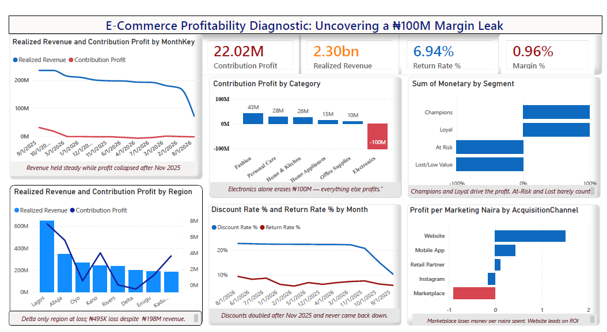

# E-Commerce Profitability Diagnostic

**Revenue held steady all year. Profit nearly disappeared. This project finds out why.**

---

## Overview
An 18,000-order e-commerce dataset (Sept 2025–Aug 2026) looked healthy on the surface — revenue stayed strong, month after month. But contribution profit told a different story, collapsing to under 1% margin for the year. This project traces that gap back to its root causes using a full Python → SQL → Power BI pipeline.

**The question:** revenue looks fine — so where did the profit go?

---

## Dataset
| | |
|---|---|
| **Source** | E-commerce transaction data (Orders, Customers, Products, Marketing, Targets) |
| **Size** | 18,000 rows |
| **Period** | Sept 2025 – Aug 2026 |
| **Format** | Excel / CSV |

**Data quality:** No nulls, no duplicates, no broken references — every formula checked out. A clean dataset, which meant the profit collapse was real, not a data error.

---

## Methodology
**Python** → cleaned and validated the raw data, then rebuilt it as a proper star schema.
**MySQL** → independently verified every finding with SQL — joins, CTEs, and window functions (`LAG`, `RANK`, `NTILE`, running totals) — cross-checked against the Python results.
**Power BI** → built the final diagnostic dashboard on the verified model, with 12 custom DAX measures for margin, discount rate, return rate, and channel ROI.

---

## Key Findings

**1. Revenue held. Profit didn't:**
Realized revenue stayed near ₦200–300M/month, but contribution margin fell from +13.2% to under 1% for the year — negative in most individual months.

**2. Discounting doubled and never came back down:**
Average discount rate jumped from ~10% to ~22-23% starting Nov 2025 — company-wide, across every channel and category — and stayed there. Statistically confirmed (p ≈ 0). It didn't even work: order volume stayed flat regardless of discount size.

**3. One category erases everyone else's gains:**
Electronics runs on a 22% base margin — too thin to survive a 22% discount. It alone accounts for a **₦100M+ loss**, wiping out most of the profit every other category generates.

**4. Two channels lose money on every naira spent:**
Marketplace and Instagram are net-negative on marketing ROI. Website is the only channel with strong, reliable returns.

**5. Returns quietly erase what's left:**
Just 6.9% of orders are returned — but they wipe out **87%** of the profit the remaining orders generate.

**6. One region operates at a flat-out loss — and it's not for the reason you'd expect:**
Delta brings in ~₦198M in revenue but is the only region with negative contribution profit. It's not a heavier Electronics mix or a higher discount rate — both are in line with every other region. The loss traces specifically to Delta's Consumer segment, where the return rate runs a full point above every other region's consumer base, and losses show up across three separate channels rather than one.

---

## Dashboard

Power BI · Star-schema model (1 fact table + 5 dimensions) · 12 DAX measures · KPI cards, trend lines, category and channel breakdowns, RFM customer segmentation, and a region-level profit/loss view.

---

## Recommendations
- Cap discounting by category — thin-margin categories like Electronics can't absorb what Fashion can
- Reassess spend on Marketplace and Instagram, or renegotiate their cost structure
- Investigate the Nov 2025 discount policy change — the exact inflection point where margin turned negative
- Audit return drivers by channel — Instagram and Marketplace also carry the highest return rates
- Investigate Delta's Consumer segment specifically — elevated returns there, not category mix or discounting, are driving the region's loss

---

## Expected Impact
Turns a vague "profit feels low" concern into a specific, evidenced diagnosis — pinpointing the exact lever (discounting), category (Electronics), channels (Marketplace, Instagram), and region (Delta) driving the gap between healthy revenue and near-zero profit.

---

## Tools
`Python` `Pandas` `SciPy` `MySQL` `Power BI` `DAX`
